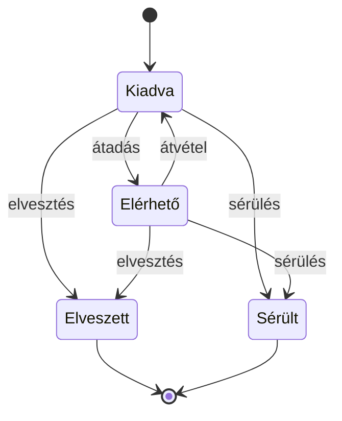
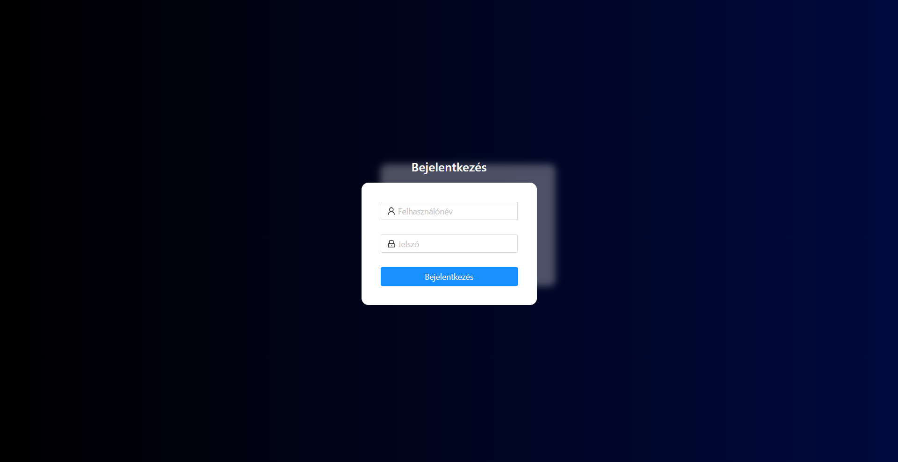
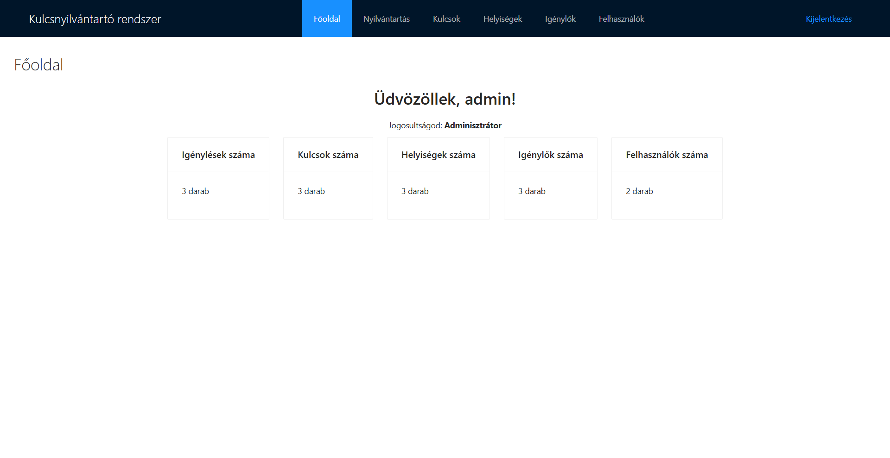
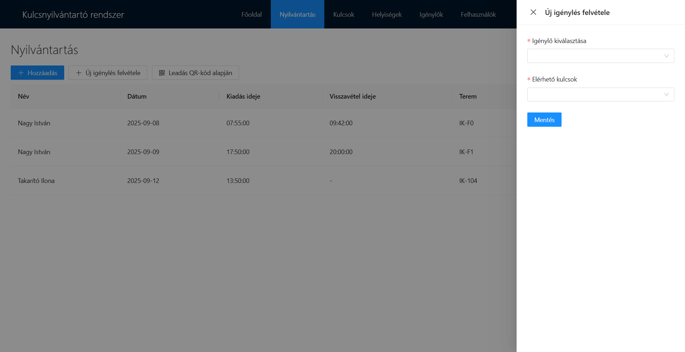
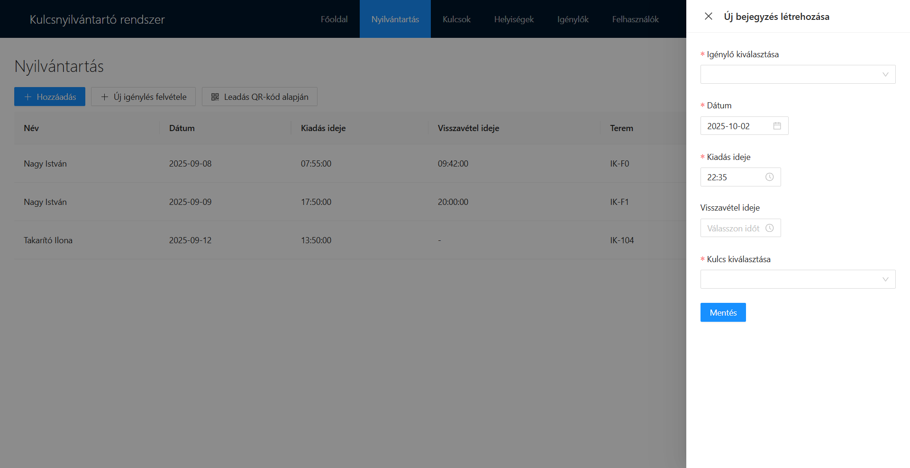
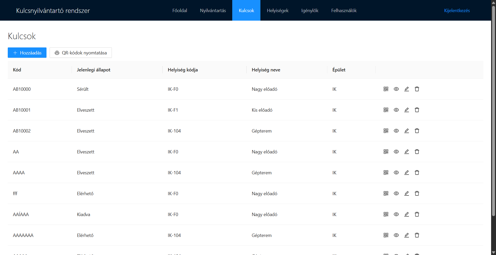
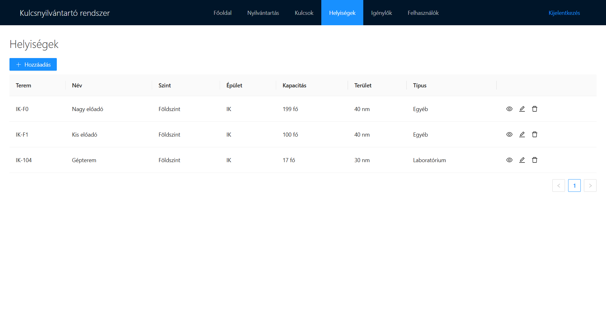
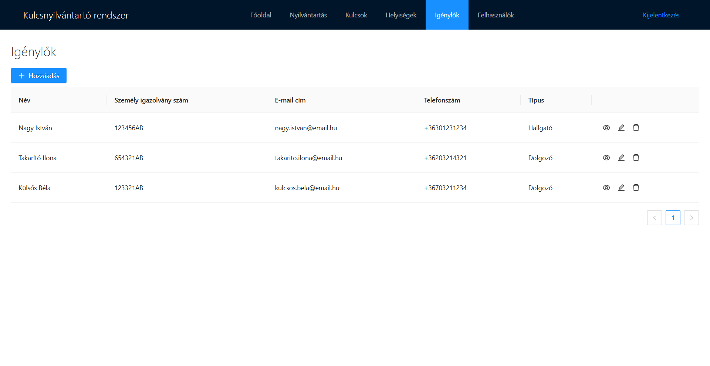
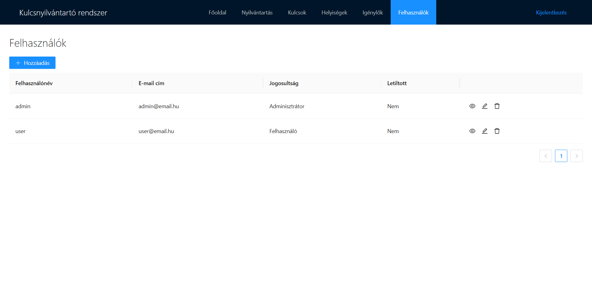
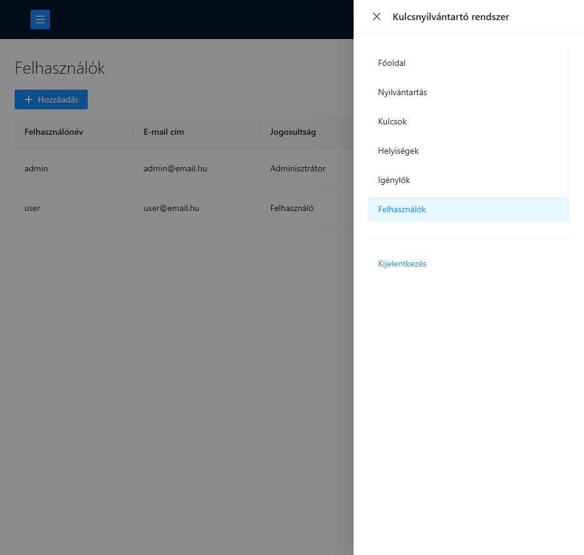

# 🔑 Kulcsnyilvántartó rendszer
> [!NOTE]
> A projektet készítette: Hagymási Bence

## 🛠 Használt technológiák
- **Backend:** Java – Spring ökoszisztéma
  - Spring Boot
  - Spring Core
  - Spring MVC
  - Spring Data
  - Spring Security
  - Spring Mail
  - Lombok
  - MapStruct
- **Frontend:** TypeScript – Angular
  - UI könyvtár: NG-ZORRO
  - QR-kód kezelés: ngx-kjua, ngx-scanner
- **Felhasználó hitelesítés:** JSON Web Token
- **Adatbázis:** PostgreSQL
- **Deploy:** Docker, Docker Compose

## 💡 Problémamegoldás
A rendszer célja egy intézményen vagy épületen belüli **kulcsnyilvántartás kezelése**, amely megkönnyíti a kulcsok **adminisztrációját** és nyomon követését. Az alkalmazás lehetővé teszi az egyszerű és gyors nyilvántartás-kezelést, például **QR-kód alapján**.

## ⚙ Funkcionalitás (teljes CRUD)
- **Felhasználókezelés**
  - Új felhasználók hozzáadása a meglévők mellett
  - Jogosultságkezelés (adminisztrátor, portás vagy felhasználó)
  - Hitelesítés JSON Web Token (JWT) segítségével
- **Kulcsnyilvántartás** (jogkörtől függően)
  - Kulcsok kiadásának és visszavételének adminisztrációja
    - egyszerűsített módon QR-kód alapján
  - Aktuálisan kiadott kulcsok nyomon követése
  - Kulcsok hozzáadása, módosítása, törlése
  - Helyiségek hozzáadása, módosítása, törlése
  - Igénylők hozzáadása, módosítása, törlése
  - Felhasználók hozzáadása, módosítása, törlése
  - E-mail küldése a hozzáadott felhasználónak generált jelszóval
- **Jogosultságkezelés**
  - admin: teljes körű (globális) hozzáférés
  - portás / felhasználó: nyilvántartás kezelése (igénylés, leadás), kulcsok és igénylők megtekintése, QR-kódok igénylése és olvasása
- **PDF generálás**
  - A kulcsokhoz QR-kód generálható PDF formátumban, amely egyszerűsíti a kezelést és gyorsabbá teszi az adminisztrációt.
- A kulcs lehetséges állapotai a rendszerben:

## 👤 Példafelhasználók
| Jogosultság         | Felhasználónév | Jelszó |
|--------------------|----------------|--------|
| Adminisztrátor      | admin          | admin  |
| Felhasználó / portás | user          | user   |

## 🗄 Adatbázisséma


## 🚀 Üzembe helyezés (deploy)
```bash
git clone https://github.com/hb3nce04/key-keeper-app.git
cd key-keeper-app
```
majd a [Docker Compose](https://docs.docker.com/) használatával:
```bash
docker compose up
```

## 📸 Képernyőképek









